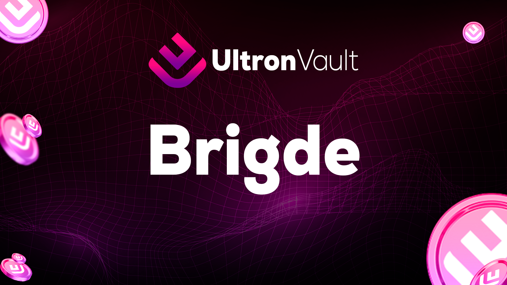

# 🟪 Brigde

<figure><figcaption></figcaption></figure>

* <mark style="background-color:red;">Ultron Vault Bridge</mark> is a platform that connects different blockchains, allowing for the transfer of digital assets from one network to another. This is especially useful for those who wish to exchange cryptocurrencies that are not available on the same network or who wish to take advantage of different resources and applications on different blockchains.

#### The benefits of Bridges include:

* Expanding trading options,&#x20;
* reducing transaction costs,&#x20;
* and the possibility of exploring arbitrage opportunities between different exchanges.&#x20;

In addition, Bridges allow users to move their digital assets from one network to another without the need to sell and repurchase them in another currency, which can be particularly useful when cryptocurrency prices are volatile.

#### A numerical example

&#x20;An <mark style="background-color:red;">Ultron Vault Bridge</mark> can be beneficial would be if someone wanted to exchange 1 Bitcoin (BTC) for Ethereum (ETH), but the exchange they are using does not offer direct BTC-ETH trading. Without a Bridge, the person would have to sell BTC for US dollars (USD) and then buy ETH with USD. This can lead to higher transaction fees and an unfavorable conversion rate. With a Bridge, the person could simply transfer the BTC to the Ethereum network and exchange it directly for ETH on an Ethereum exchange, avoiding the need for USD conversion.

Bridge Ultron Vault are a useful tool for cryptocurrency investors and traders who wish to access different blockchains and applications and expand their trading options.
