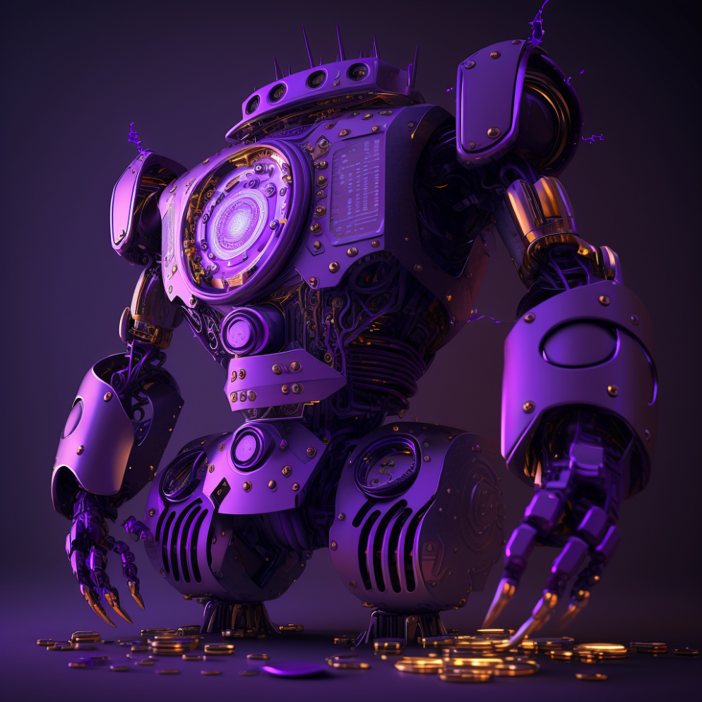
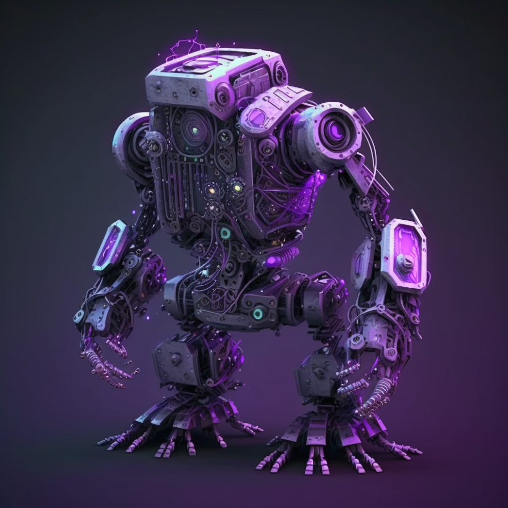
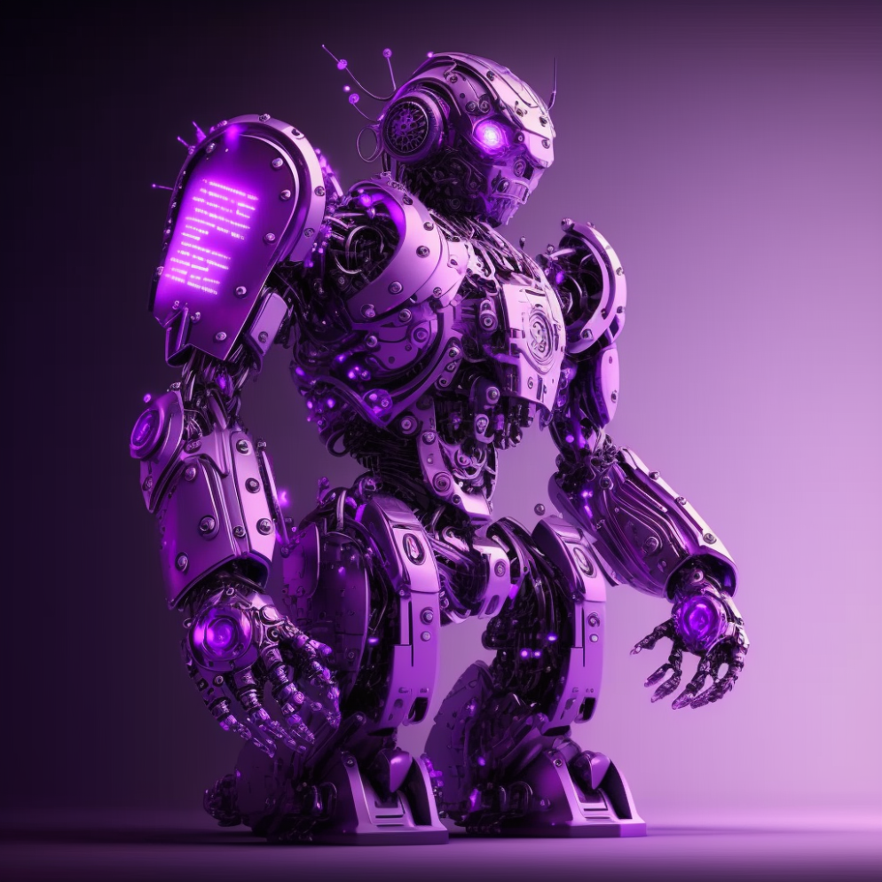
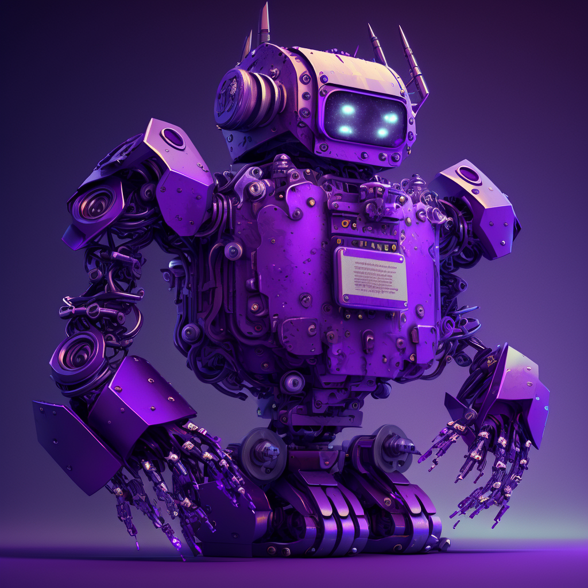
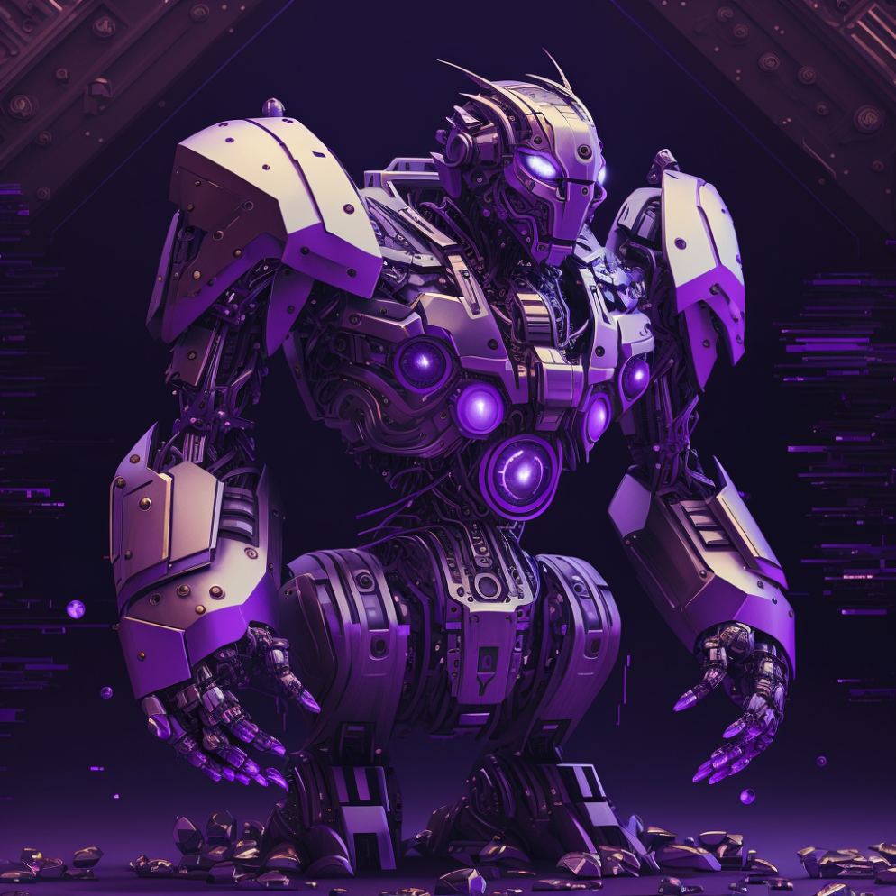
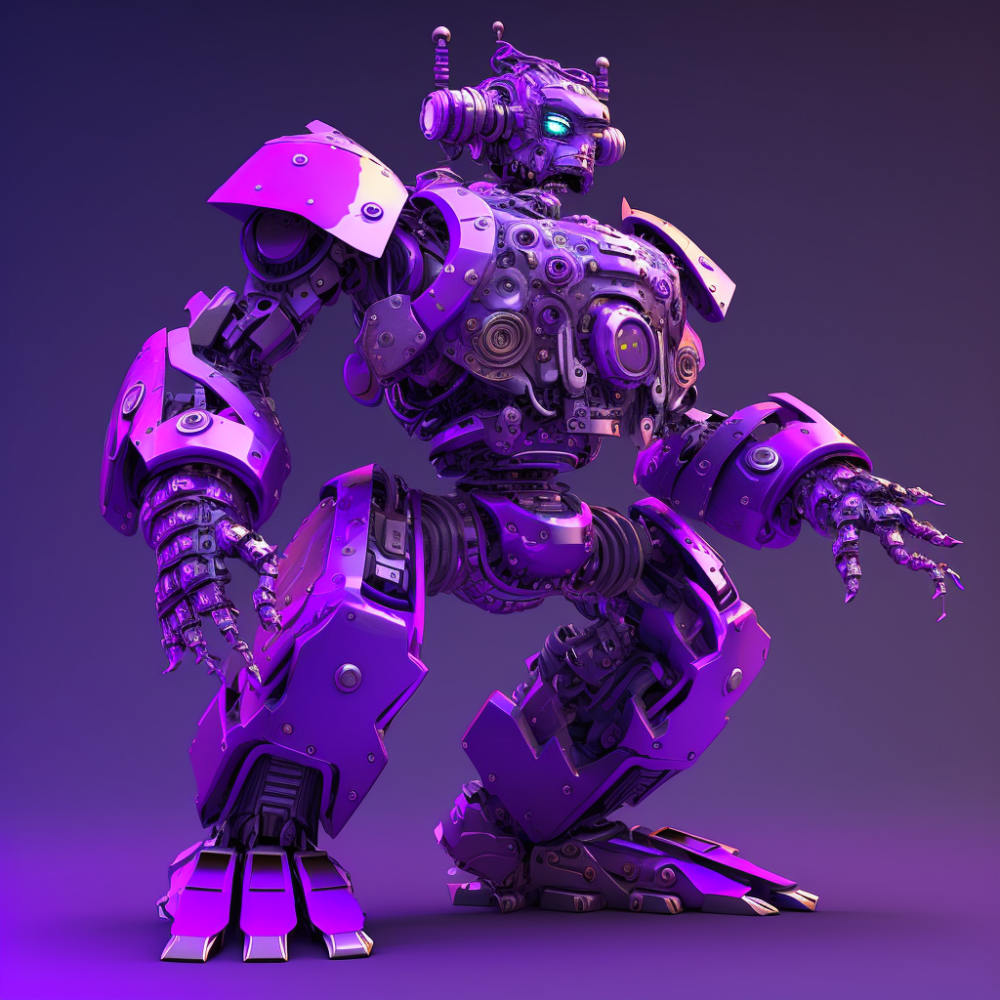

# 🟪 NFT Staking

* _Ultron Vault is a decentralized exchange that is bringing the staking NFT technology to the world of decentralized finance. The process of staking NFTs on Ultron Vault is a simple and secure process that involves locking a non-fungible token (NFT) in a specific wallet for a predetermined period of time._
* _By staking NFTs on Ultron Vault, NFT holders can earn rewards in the form of cryptocurrencies or other tokens, as well as have the opportunity to support ecological projects and receive rewards in return. Additionally, staking NFTs can be used as a way to ensure the exclusivity and rarity of certain NFT collections._
* _One of the main benefits of staking NFTs is that it allows NFT holders to generate passive income without having to sell their digital assets. Additionally, staking NFTs helps maintain the stability of the decentralized exchange ecosystem by encouraging active participation from NFT holders in the community._
* _The application of API in the staking NFT process on Ultron Vault offers even more benefits. With the API, it is possible to automate the entire process of staking NFTs, allowing users to manage their digital assets more efficiently and easily. Additionally, the API enables integration with other platforms and applications, making staking NFTs even more accessible and attractive to NFT holders._

<figure><figcaption></figcaption></figure>

 

<figure><figcaption></figcaption></figure>

 

<figure><figcaption></figcaption></figure>

<figure><figcaption></figcaption></figure>

 

<figure><figcaption></figcaption></figure>

 

<figure><figcaption></figcaption></figure>

