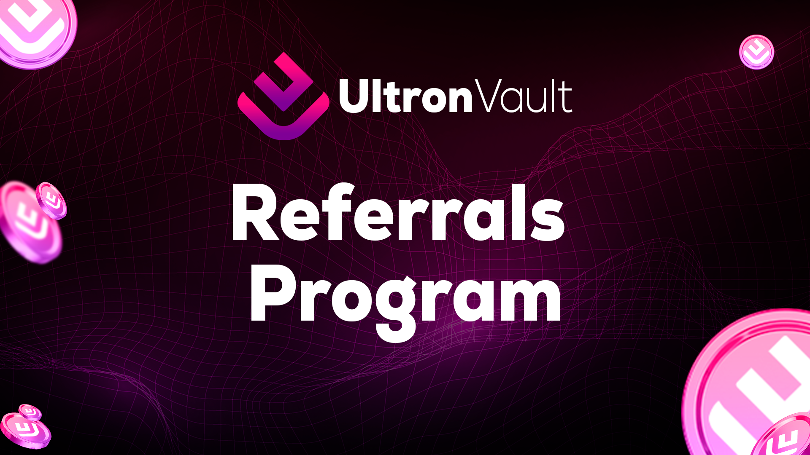

# 🟪 Referrals Program

<figure><figcaption></figcaption></figure>

A <mark style="background-color:red;">Referral Program</mark> is a marketing strategy in which Ultron Vault rewards its existing investors for referring new investors to our platform. <mark style="background-color:red;">Referral programs</mark> are becoming increasingly common as a way to promote the use of cryptocurrency platforms and encourage more users to participate.

Cryptocurrency <mark style="background-color:red;">referral programs t</mark>ypically offer incentives such as transaction fee discounts, deposit credits, or token rewards to customers who refer new users to the platform. The goal is to create an engaged community around the platform, increasing the number of users and thus, <mark style="background-color:red;">liquidity.</mark>

#### The benefits of our Referral Program at Ultron Vault include:

* <mark style="background-color:red;">Increased user base:</mark> By incentivizing existing users to refer new users, Ultron Vault can expand its user base and increase liquidity.
* <mark style="background-color:red;">Improved reputation for Ultron Vault:</mark> When existing users recommend the Ultron Vault platform to others, it can increase trust in the platform and improve its reputation in the market.
* <mark style="background-color:red;">Reduced marketing costs:</mark> Referral programs are a low-cost form of marketing because they encourage users themselves to promote the platform.
* <mark style="background-color:red;">Financial incentives for users:</mark> Users who refer new users to Ultron Vault can receive financial rewards, which can be an additional source of income.

#### An example

* <mark style="background-color:red;">Ultron Vault</mark> offers a 5% bonus in ULTRON to users who invite friends to sign up for the platform and buy or sell at least 1 BNB in ULTRON.
