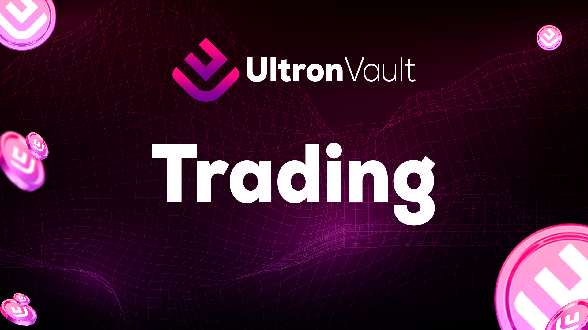

# 🟪 Trading

<figure><figcaption></figcaption></figure>

<mark style="background-color:red;">Ultron Vault Trading</mark> refers to the buying and selling of digital assets with the aim of making a profit from price fluctuations. Trading is one of the most popular forms of cryptocurrency investment and involves analyzing price charts and technical indicators to identify <mark style="background-color:red;">buying and selling opportunities.</mark>

#### Some of the benefits of trading on Ultron Vault include:

* Potential for high profits: Due to the volatility of cryptocurrency prices, trading can offer the opportunity to make high profits in short periods of time. For example, in 2020, the price of Bitcoin increased by more than 300% in just a few months.
* 24/7 access: The cryptocurrency market is open 24 hours a day, seven days a week, which means that traders have the flexibility to trade at any time.
* Liquidity: The cryptocurrency market is highly liquid, which means that it is easy to buy and sell digital assets without significantly affecting the price.

#### Here's an example to illustrate the profit potential in Ultron Vault trading:

* Suppose a trader buys 1 Bitcoin at a price of US$10,000 and sells that same Bitcoin a few weeks later at a price of US$15,000. In this scenario, the trader would have made a profit of US$5,000, or a 50% increase on the initial investment.

Ultron Vault trading can offer the opportunity to make high profits in short periods of time, thanks to the volatility of cryptocurrency prices and the accessibility of the market.
