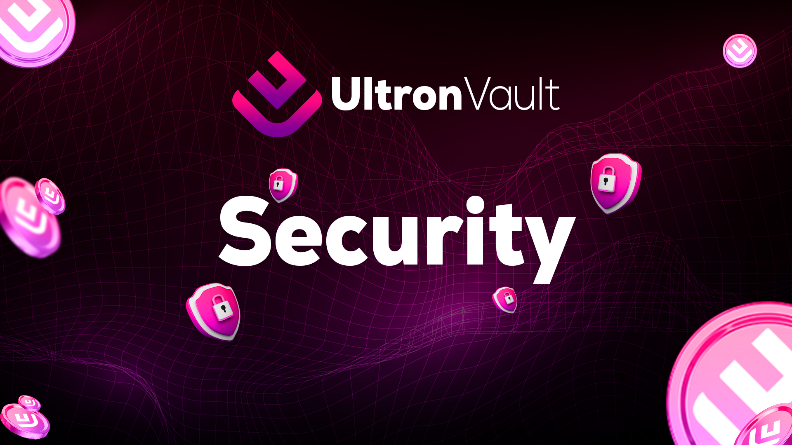

# 🟪 List of Security

<figure><figcaption></figcaption></figure>

<figure><figcaption>
KYC (comming soon.)
</figcaption></figure>

 

<figure><figcaption>
AUDIT (comming soon.)
</figcaption></figure>

 

<figure><figcaption>
SAFU (comming soon.)
</figcaption></figure>

We are extremely pleased with the achievement of the <mark style="background-color:red;">KYC, audit, and SAFU</mark> seals. These accomplishments are crucial to increasing investor confidence and ensuring the security of their assets on the platform.

* The <mark style="background-color:red;">KYC</mark> (Know Your Customer) seal is an important security mechanism that helps prevent money laundering and other illegal activities. By implementing KYC, Ultron Vault ensures that there will be no fraudulent behavior.
* The <mark style="background-color:red;">audit</mark> is another critical element in increasing investor confidence. By undergoing an independent audit, Ultron Vault can ensure that its practices and protocols are in compliance with the highest standards of security and transparency.
* Finally, the <mark style="background-color:red;">SAFU</mark> (Secure Asset Fund for Users) seal is an initiative of Binance, the world's largest cryptocurrency exchange, to ensure that users are protected in the event of hacks or other unforeseen events. By adopting the SAFU seal, Ultron Vault demonstrates its commitment to keeping users' assets safe and secure.

_<mark style="background-color:red;">These accomplishments leave me confident that Ultron Vault is committed to the security and transparency of the platform, and I look forward to continuing to follow the project's success.</mark>_
